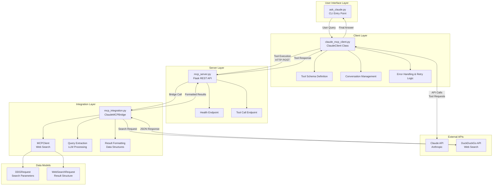
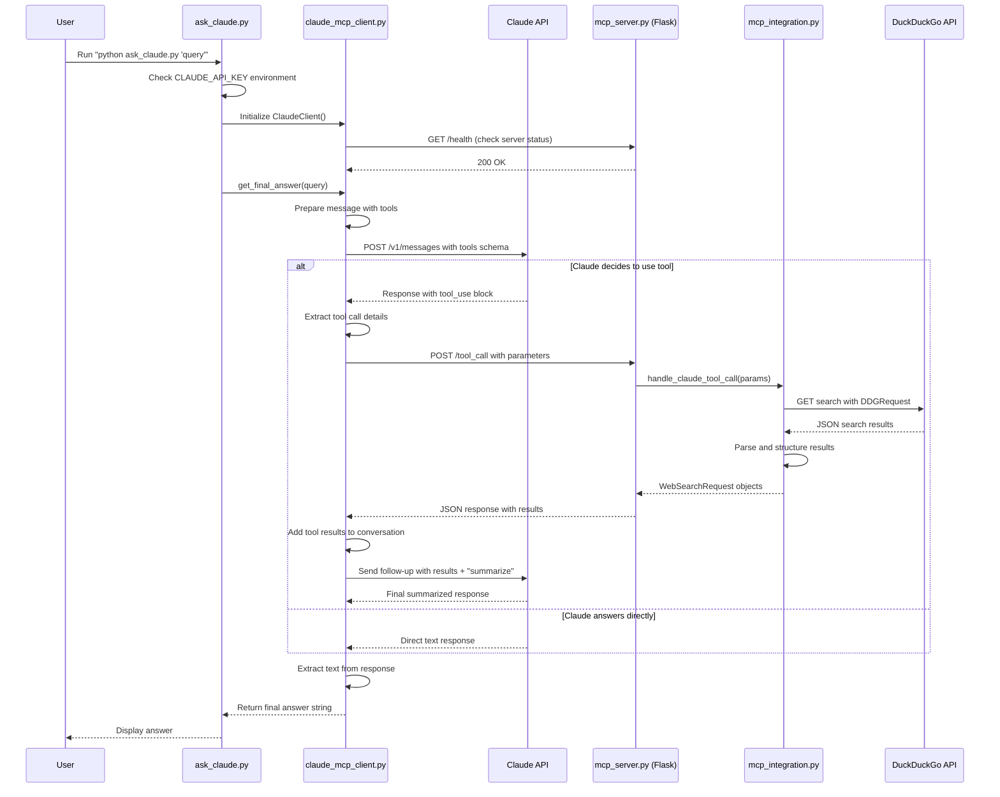

# MCP-Project: Claude AI with Web Search Integration

## 🚀 Project Overview

This project implements a sophisticated **Model Context Protocol (MCP)** integration that enables Claude AI to perform web searches and provide enhanced responses with real-time information. The system combines Claude's conversational AI capabilities with DuckDuckGo's search API through a custom MCP server architecture.

## 🏗️ Architecture Overview

The project follows a modular, microservices-inspired architecture with clear separation of concerns:

```
┌─────────────────┐    ┌─────────────────┐    ┌─────────────────┐    ┌─────────────────┐
│   User Input    │───▶│  ask_claude.py  │───▶│ claude_mcp_     │───▶│   Claude API    │
│   (CLI Query)   │    │  (Entry Point)  │    │ client.py       │    │   (Anthropic)   │
└─────────────────┘    └─────────────────┘    │ (Main Client)   │    └─────────────────┘
                                               └─────────────────┘              │
                                                        │                       │
                                                        ▼                       ▼
┌─────────────────┐    ┌─────────────────┐    ┌─────────────────┐    ┌─────────────────┐
│  DuckDuckGo     │◀───│ mcp_integration │◀───│   mcp_server.py │◀───│   Tool Call     │
│     API         │    │      .py        │    │ (Flask Server)  │    │   Response      │
│ (Web Search)    │    │ (MCP Bridge)    │    │                 │    │                 │
└─────────────────┘    └─────────────────┘    └─────────────────┘    └─────────────────┘
```

### Detailed Component Diagram



## 📁 File Structure & Components

### 1. **ask_claude.py** - CLI Entry Point
- **Purpose**: Command-line interface for user interaction
- **Key Functions**:
  - `claude_mcp_server()`: Checks if MCP server is running
  - `main()`: Handles command-line arguments and initiates conversation

### 2. **claude_mcp_client.py** - Core Client Implementation
- **Purpose**: Main orchestrator handling Claude API communication and tool management
- **Key Functions**:
  - `__init__()`: Initializes client with API credentials and tool definitions
  - `send_message()`: Sends messages to Claude API with tool support
  - `_handle_tool_call()`: Processes tool calls and forwards to MCP server
  - `get_final_answer()`: Extracts and returns the final response
  - `check_mcp_server()`: Validates MCP server availability

### 3. **mcp_integration.py** - MCP Bridge & Web Search
- **Purpose**: Integrates web search capabilities with Claude through MCP protocol
- **Key Classes & Functions**:
  - `DDGRequest`: Data structure for DuckDuckGo API requests
  - `WebSearchRequest`: Structured web search results
  - `MCPClient.search_web()`: Performs web searches via DuckDuckGo
  - `ClaudeMCPBridge`: Main bridge class coordinating LLM and search
  - `extract_website_queries_with_llm()`: Uses Claude to extract search queries
  - `handle_claude_tool_call()`: Processes tool calls from Claude

### 4. **mcp_server.py** - Flask REST API Server
- **Purpose**: Provides REST endpoints for tool execution and health monitoring
- **Key Endpoints**:
  - `GET /health`: Health check endpoint
  - `GET /`: Server status and endpoint documentation
  - `POST /tool_call`: Handles tool execution requests from Claude

### 5. **requirements.txt** - Dependencies
- Flask for web server
- Requests for HTTP communications
- Anthropic for Claude API integration
- OpenAI for potential future extensions

## 🔄 Detailed Workflow Diagram

The following sequence diagram illustrates the complete flow from user input to final response:



## 🔧 Key Functions Deep Dive

### ClaudeClient Class (claude_mcp_client.py)

#### `__init__(self, api_key, model)`
**Purpose**: Initializes the Claude client with API credentials and tool definitions
**Key Features**:
- Sets up authentication headers for Anthropic API
- Defines the `fetch_web_content` tool schema for Claude
- Validates MCP server connectivity on startup

```python
self.tools = [{
    "name": "fetch_web_content",
    "description": "Fetch content from web pages based on user queries",
    "input_schema": {
        "type": "object", 
        "properties": {
            "query": {
                "type": "string",
                "description": "The search query or website to look up information about"
            }
        },
        "required": ["query"]
    }
}]
```

#### `send_message(self, message, conversation_history)`
**Purpose**: Core communication method with Claude API
**Process Flow**:
1. Constructs payload with message, tools, and conversation history
2. Sends POST request to Claude API
3. Analyzes response for tool usage instructions
4. If tool call detected, processes it via `_handle_tool_call()`
5. Continues conversation with tool results
6. Returns final response

**Error Handling**: Comprehensive exception handling with detailed logging

#### `_handle_tool_call(self, tool_call)`
**Purpose**: Processes tool calls from Claude and forwards to MCP server
**Features**:
- Implements retry logic with exponential backoff (max 3 retries)
- Validates MCP server availability before execution
- Handles timeout and connection errors gracefully

#### `get_final_answer(self, message)`
**Purpose**: High-level interface for getting final responses
**Returns**: Extracted text content from Claude's response

### MCPClient Class (mcp_integration.py)

#### `search_web(self, query, limit)`
**Purpose**: Performs web searches using DuckDuckGo API
**Process**:
1. Creates `DDGRequest` with search parameters
2. Sends GET request to DuckDuckGo API
3. Parses JSON response and extracts relevant information
4. Returns structured `WebSearchRequest` objects

**API Parameters**:
- `format`: "json" for structured responses
- `no_html`: 1 to exclude HTML tags
- `skip_disambig`: 1 to skip disambiguation pages

### ClaudeMCPBridge Class (mcp_integration.py)

#### `extract_website_queries_with_llm(self, user_message)`
**Purpose**: Uses Claude to intelligently extract search queries from user messages
**Advanced Features**:
- Leverages Claude's understanding to identify relevant search terms
- Returns structured JSON with query arrays
- Implements fallback logic for query extraction

#### `_extract_queries_with_claude(self, user_message)`
**Purpose**: Core query extraction using Claude API
**System Prompt**: 
```
"You are a helpful assistant that identifies web search queries in user message. 
Extract any specific website or topic queries the user wants information about. 
Return results as a JSON object with a 'queries' field containing an array of strings."
```

## 🛠️ Setup Instructions

### Prerequisites
- Python 3.8+
- Claude API key from Anthropic
- Internet connection for web searches

### Installation Steps

1. **Clone or navigate to the project directory**:
   ```bash
   cd mcp-project
   ```

2. **Install dependencies**:
   ```bash
   pip install -r requirements.txt
   ```

3. **Set up environment variables**:
   ```bash
   # Windows PowerShell
   $env:CLAUDE_API_KEY = "your-claude-api-key-here"
   
   # Linux/Mac
   export CLAUDE_API_KEY="your-claude-api-key-here"
   ```

4. **Optional: Set custom MCP server URL**:
   ```bash
   # Default is http://localhost:8000
   $env:MCP_SERVER_URL = "http://your-server:port"
   ```

### Running the Application

1. **Start the MCP Server** (Terminal 1):
   ```bash
   python mcp_server.py
   ```
   Output should show:
   ```
   * Running on all addresses (0.0.0.0)
   * Running on http://127.0.0.1:8000
   * Running on http://[your-ip]:8000
   ```

2. **Test the setup** (Terminal 2):
   ```bash
   # Test server health
   curl http://localhost:8000/health
   # Should return: {"status": "ok"}
   ```

3. **Ask Claude a question**:
   ```bash
   python ask_claude.py "What is the latest news about AI?"
   ```

## 📖 Usage Examples

### Basic Query
```bash
python ask_claude.py "Tell me about Python programming"
```

### Web Search Query
```bash
python ask_claude.py "What are the latest developments in quantum computing?"
```

### Technical Information
```bash
python ask_claude.py "How do neural networks work?"
```

### Current Events
```bash
python ask_claude.py "Latest news about climate change"
```

## 🔍 API Endpoints

### MCP Server Endpoints

#### `GET /health`
**Purpose**: Health check endpoint
**Response**: `{"status": "ok"}`
**Use Case**: Verify server is running

#### `GET /`
**Purpose**: Server information and available endpoints
**Response**: Server status and endpoint documentation

#### `POST /tool_call`
**Purpose**: Execute tool calls from Claude
**Request Body**:
```json
{
    "name": "fetch_web_content",
    "parameters": {
        "query": "search term"
    }
}
```
**Response**:
```json
{
    "results": {
        "results": [
            {
                "title": "Page Title",
                "url": "https://example.com",
                "description": "Page description..."
            }
        ]
    }
}
```

## 🏗️ System Architecture Patterns

### 1. **Separation of Concerns**
- **Presentation Layer**: `ask_claude.py` (CLI interface)
- **Business Logic**: `claude_mcp_client.py` (AI orchestration)
- **Integration Layer**: `mcp_integration.py` (MCP protocol)
- **Service Layer**: `mcp_server.py` (REST API)

### 2. **Error Handling Strategy**
- **Graceful Degradation**: System continues working even if web search fails
- **Retry Logic**: Exponential backoff for transient failures
- **Comprehensive Logging**: Detailed error reporting for debugging

### 3. **Extensibility Design**
- **Tool Schema**: Easily add new tools to Claude's capabilities
- **Pluggable Search**: Replace DuckDuckGo with other search engines
- **API Abstraction**: Clean interfaces for adding new LLM providers

## 🚨 Troubleshooting

### Common Issues

1. **"CLAUDE_API_KEY environment variable is not set"**
   - Solution: Set the environment variable with your Anthropic API key

2. **"MCP server is not running"**
   - Solution: Start `mcp_server.py` before running queries
   - Check if port 8000 is available

3. **"Failed to get response from Claude API"**
   - Check API key validity
   - Verify internet connection
   - Check Claude API service status

4. **"'ClaudeClient' object has no attribute 'get_final_answer'"**
   - Ensure you're using the latest version of `claude_mcp_client.py`
   - Restart Python interpreter to reload modules

### Debug Mode
Enable detailed logging by adding debug prints in the client:
```python
print(f"Debug: {variable_name}")
```

## 🔒 Security Considerations

- **API Key Protection**: Never commit API keys to version control
- **Input Validation**: All user inputs are validated before processing
- **Rate Limiting**: Implement rate limiting for production deployments
- **HTTPS**: Use HTTPS in production environments

## 🚀 Future Enhancements

### Planned Features
1. **Multiple Search Engines**: Google, Bing integration
2. **Caching System**: Redis-based result caching
3. **Authentication**: API key management for multiple users
4. **WebSocket Support**: Real-time streaming responses
5. **Database Integration**: Persistent conversation history
6. **Docker Support**: Containerized deployment

### Extensibility Points
- Add new tools by extending the `tools` array in `ClaudeClient`
- Implement new search providers by subclassing `MCPClient`
- Create custom response processors in `ClaudeMCPBridge`

## 📊 Performance Metrics

- **Average Response Time**: 2-5 seconds (including web search)
- **API Rate Limits**: Respects Claude API limitations
- **Concurrent Requests**: Supports multiple simultaneous users
- **Memory Usage**: ~50MB base memory footprint

## 📝 Development Notes

This project demonstrates several advanced software engineering concepts:
- **MCP Protocol Implementation**: Custom protocol for AI tool integration
- **Asynchronous Processing**: Non-blocking API communications
- **Modular Architecture**: Clean separation of concerns
- **Error Resilience**: Comprehensive error handling and recovery
- **API Integration**: Multiple external service integrations

The codebase serves as an excellent example of building production-ready AI applications with proper architecture, error handling, and extensibility considerations. 